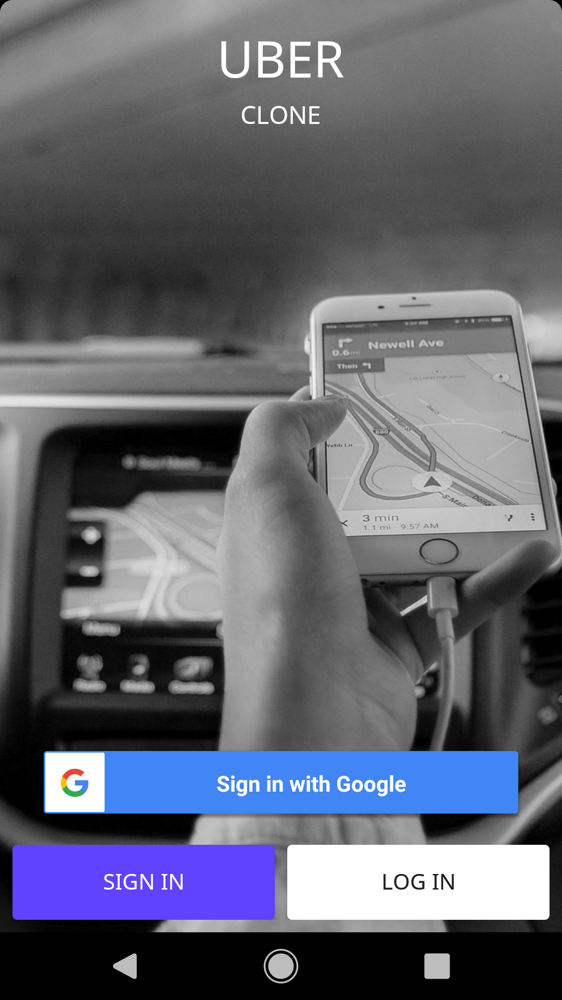
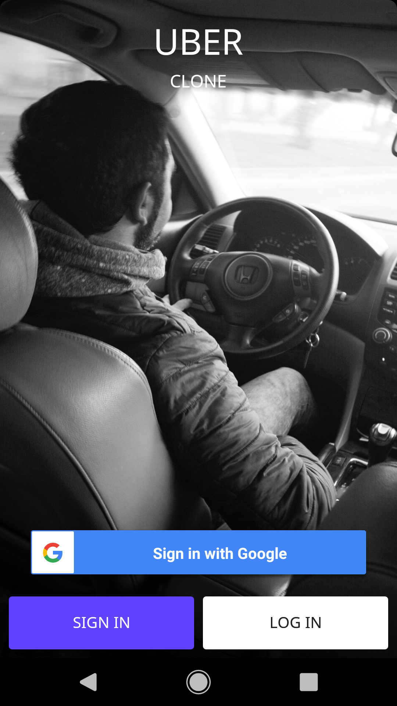

# UberClone

**Refactoring code...**

## Setup Guide

### Setup firebase
- Add a new project your [Firebase console](https://console.firebase.google.com/)
- Add a new Android application, you have to do add 2 applicatitons, driver and rider one.
- Then go to the project settings > Cloud Messaging. On this tab you will copy the Server Key. You will put that key in common/ConfigApp.java file on CLOUD_MESSAGING_SERVER_GEY constant on rider and driver apps

### Setup Google APIs
- Go to your [Google cloud platform](https://console.cloud.google.com/) and select your project or create a new project.
- Search and active this API keys:
    - Places SDK for Android
    - Maps SDK for Android
    - Directions API
- Go to your Credentials, create an API Key 
- You will put that API key in common/ConfigApp.java file on GOOGLE_API_KEY constant on driver and rider apps

## Screenshots
|Driver Application|Rider Application|
|---|---|
|||
